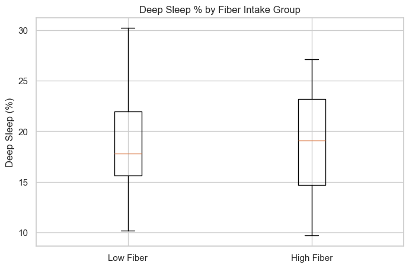
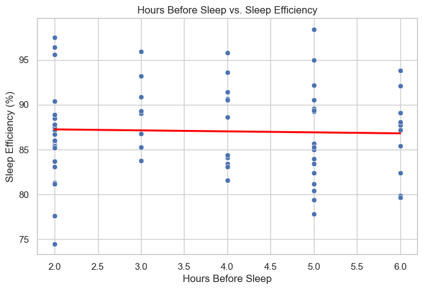
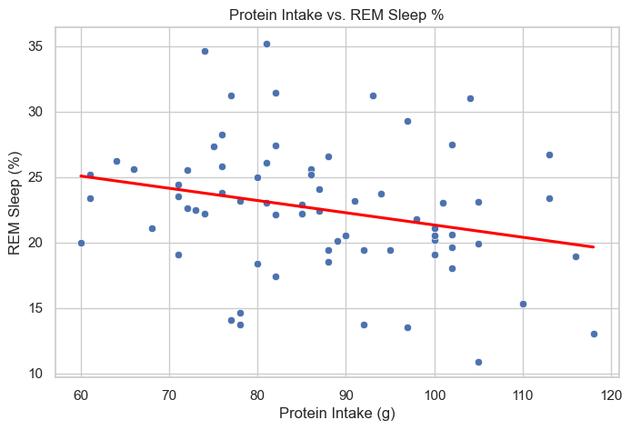
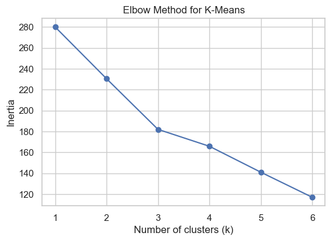
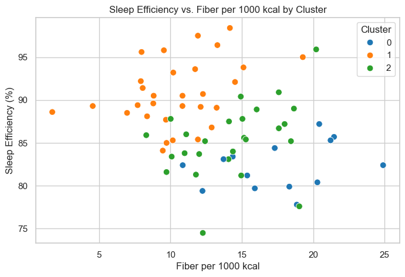
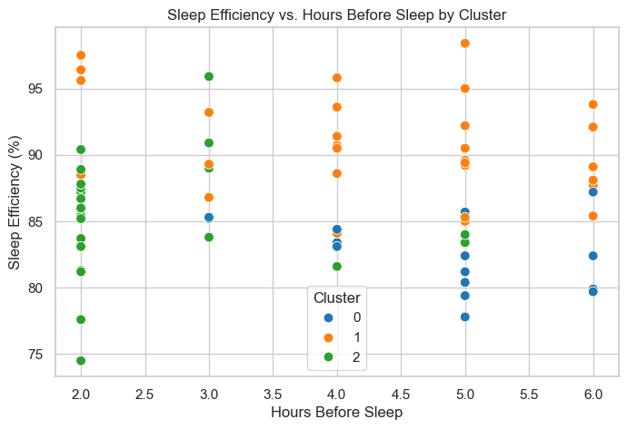

# Diet & Sleep Study – Final Report

## 1 Introduction

Sleep is increasingly recognised as a core pillar of health. For people with autoimmune conditions (the author included), restorative sleep can mitigate flare‑ups by dampening systemic inflammation. Although large‑scale studies suggest that nutrition modulates sleep architecture, individual responses vary. This project explores **how my own dietary patterns relate to nightly sleep efficiency and sleep stages** using three months of self‑logged food intake (MyFitnessPal) and smartwatch‑derived sleep metrics.

* **Dataset scope** 83 consecutive days (2025‑01‑01 → 2025‑03‑31)
* **Diet fields** Calories, macronutrients (g), fibre (g), sugar (g), last‑meal hour
* **Sleep fields** Total sleep (h), efficiency (%), deep / REM / light sleep (%), resting HR, natural‑wake flag

All rows with alarm‑based wake‑ups were removed, leaving **70 natural‑wake days** for analysis.

---

## 2 Methods

### 2.1 Pre‑processing

1. Merge diet + sleep tables on *Date*.
2. Filter `Natural Wakeup == True`.
3. Feature engineering:

   * `Hours Before Sleep = 24 – Last Meal Hour`
   * `Fibre per 1000 kcal`, `Protein per 1000 kcal` (energy‑normalised)
4. Descriptive statistics and visual EDA in **eda.ipynb**.

### 2.2 Statistical Hypotheses

| #  | Question                                  | Test           | Result                     |
| -- | ----------------------------------------- | -------------- | -------------------------- |
|  1 | High fibre → more deep sleep?             | Mann‑Whitney U | p = 0.50 (ns)              |
|  2 | Eating earlier → higher sleep efficiency? | Spearman ρ     | ρ = -0.028, p = 0.82 (ns)  |
|  3 | Protein intake ↔ REM %                    | Spearman ρ     | ρ = -0.28, p = 0.018 (sig) |

Figures 1–3 visualise each test.

### 2.3 Machine Learning

* **Target** Sleep Efficiency (%)
* **Features** Normalised fibre, protein, hours‑before‑sleep, fat (g), carbs (g), sugar (g)
* Models: Baseline Linear Regression, Random Forest (100 trees)

### 2.4 Unsupervised Clustering

K‑Means on scaled `[Fibre/1000, Protein/1000, HoursBefore, SleepEfficiency]`.  Elbow and silhouette metrics indicated **k = 3**.

---

## 3 Results

### 3.1 Hypothesis Tests

| Fig                                                  | Caption                                                               |
| ---------------------------------------------------- | --------------------------------------------------------------------- |
| **Figure 1.** Deep Sleep % by fibre group            |                |
| **Figure 2.** Hours before sleep vs sleep efficiency |  |
| **Figure 3.** Protein intake vs REM sleep %          |                          |

Only Test 3 showed a significant (negative) association.

### 3.2 Predictive Modelling

**Linear Regression Performance**
• R² = ‑0.128 • RMSE = 6.56

The negative R² value indicates that this linear model performs worse than simply predicting the average sleep‑efficiency for every night.

| Feature              | Coefficient |
| -------------------- | ----------- |
| Hours Before Sleep   | +0.28       |
| Carbohydrates (g)    | +0.18       |
| Protein / 1000 kcal   | ‑0.09       |
| Sugar (g)            | ‑0.43       |
| Fat (g)              | ‑1.06       |
| Fibre / 1000 kcal     | ‑1.23       |

**Random Forest Performance**
• R² = ‑0.060 • RMSE = 6.36

Again, the negative R² shows the random‑forest model is still below a naïve mean‑predictor and offers no practical explanatory power.

**Feature Importances:**
```
Fiber per 1000kcal    0.246248
Sugar (g)             0.244092
Fat (g)               0.177658
Carbohydrates (g)     0.149030
Protein per 1000kcal  0.128812
Hours Before Sleep    0.054161
```

Both models under‑performed (negative R²), suggesting the chosen features alone cannot explain nightly efficiency.

### 3.3 Clustering Insights



| Cluster |      Fibre/1000 |    Protein/1000 | Hours Before |     Sleep Eff % |
| ------- | --------------: | --------------: | -----------: | --------------: |
|  0      | **17.5** (high) |           36.6 |        4.93 |  **82.3** (low) |
|  1      |      10.5 (low) |           38.3 |        4.30 | **90.7** (high) |
|  2      |      14.3 (mid) | **43.0** (high) |        2.50 |      85.4 (mid) |

Cluster 1 (low fibre, 4–5 h gap) aligns with best efficiency; Cluster 0 (very high fibre) with poorest.

Scatter views:




---

## 4 Discussion

* **Null findings are informative:** Neither total fibre nor meal timing predicted sleep efficiency in isolation, contrary to popular advice.
* **Protein ↔ REM trade‑off:** Higher protein days correlated with reduced REM %, echoing literature on amino‑acid competition for tryptophan.
* **Complex interactions:** Clusters highlight that moderate fibre + moderate protein + 4 h buffer seems most favourable; extremes in fibre or eating very close to bedtime coincide with poorer outcomes.
* **Model limitations:** Negative R² values imply unmeasured covariates (stress, screen exposure, exercise) dominate nightly efficiency.

### Future Work

* Incorporate heart‑rate‑variability, step count, or evening screen time.
* Extend logging to ≥ 6 months for seasonal effects.
* Try mixed‑effects or time‑series models to capture within‑person trends.

---

## 5 Reproducibility

See **README** for environment setup.  All code is in `eda.ipynb` and `ml.ipynb` – run top‑to‑bottom to reproduce every figure and table.

> **AI‑assistance disclosure:** Some wording and code refactor suggestions were drafted with ChatGPT; all analyses were executed and validated by the author.
